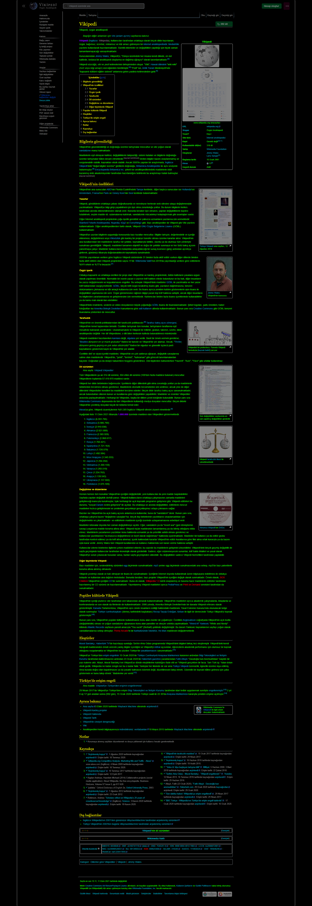

# vikipedi-koyu-tema

[`Stylus`](https://github.com/openstyles/stylus)
[`xStyle`](https://github.com/FirefoxBar/xStyle)
[`Usercss`](https://github.com/openstyles/stylus/wiki/Usercss)

[Vikipedi](https://tr.wikipedia.org)   için hazırlandı, diğer wikipedia projeleriyle uyumlu değildir.

## Kurulum

#### Temayı kullanabilmeniz için tarayıcınızın desteklediği bir stil uygulama eklentisi yüklemeniz gerekiyor. *Stylus* en çok kullanılanlardan bir tanesi, dileğiniz başka bir eklentiyi de kullanabilirsiniz.

✔ *Stylus*'u tarayıcınıza ekleyin ([Firefox](https://addons.mozilla.org/en-US/firefox/addon/styl-us/) ) ([Brave, Chrome](https://chrome.google.com/webstore/detail/stylus/clngdbkpkpeebahjckkjfobafhncgmne) ) ([Opera](https://addons.opera.com/en-gb/extensions/details/stylus/) )

✔ [Buradan](https://github.com/taner1es/vikipedi-koyu-tema/raw/main/vikipedi-koyu-tema.user.css) *usercss* kurulumunu da tamamlayıp, güncellemeleri de otomatik olarak bu repo üzerinden alabilirsiniz.

### Alternatif kurulum

*  Alternatif olarak *xStyle* kullanabilirsiniz  ([Firefox](https://addons.mozilla.org/firefox/addon/xstyle/) ) ([Brave, Chrome](https://chrome.google.com/webstore/detail/xstyle/hncgkmhphmncjohllpoleelnibpmccpj) ) 

*  *xStyle*'da kurulumu tamamlayabilmek için manuel olarak [usercss](https://github.com/taner1es/vikipedi-koyu-tema/raw/main/vikipedi-koyu-tema.user.css) linkini ekleyip güncellemeniz gerekiyor.

## Görünüm

### Anasayfa

### Madde
